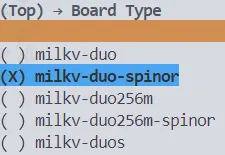

<!-- 简体中文 | [English](README-en.md) -->

# 目录

- [目录](#目录)
- [项目简介](#项目简介)
  - [处理器规格](#处理器规格)
  - [硬件资料](#硬件资料)
- [SDK 目录结构](#sdk-目录结构)
  - [Solutions 说明](#solutions-说明)
    - [解决方案目录结构](#解决方案目录结构)
- [SDK 编译使用说明](#sdk-编译使用说明)
  - [编译环境准备](#编译环境准备)
    - [依赖安装](#依赖安装)
    - [编译工具链下载](#编译工具链下载)
  - [编译步骤及说明](#编译步骤及说明)
    - [编译步骤](#编译步骤)
    - [镜像文件说明](#镜像文件说明)
  - [固件烧录](#固件烧录)
  - [运行说明](#运行说明)
- [User Manual](#user-manual)
- [关于算能](#关于算能)

<br>

# 项目简介

- 本仓库提供[算能科技](https://www.sophgo.com/)端侧处理器`CV181x`和`CV180x`两个系列处理器的软件开发包(SDK)
- 主要适用于官方 EVB

<br>

## 处理器规格

- [处理器产品简介](https://www.sophgo.com/product/index.html)

<br>

## 硬件资料

- [《CV180xB EVB 板硬件指南》](https://sophon-file.sophon.cn/sophon-prod-s3/drive/23/03/14/14/CV180xB_EVB%E6%9D%BF%E7%A1%AC%E4%BB%B6%E6%8C%87%E5%8D%97_V1.0.pdf)
- [《CV180xC EVB 板硬件指南》](https://sophon-file.sophon.cn/sophon-prod-s3/drive/23/03/18/18/CV180xC_EVB%E6%9D%BF%E7%A1%AC%E4%BB%B6%E6%8C%87%E5%8D%97_V1.0.pdf)
- [《CV181xC EVB 板硬件指南》](https://sophon-file.sophon.cn/sophon-prod-s3/drive/23/03/15/14/CV181xC_QFN_EVB%E6%9D%BF%E7%A1%AC%E4%BB%B6%E6%8C%87%E5%8D%97_V1.0.pdf)
- [《CV181xH EVB 板硬件指南》](https://sophon-file.sophon.cn/sophon-prod-s3/drive/23/03/15/15/CV181xH_EVB%E6%9D%BF%E7%A1%AC%E4%BB%B6%E6%8C%87%E5%8D%97_V1.0.pdf)

<br>

# SDK 目录结构

todo

<br>

## Solutions 说明

todo

<br>

### 解决方案目录结构

todo

<br>

# SDK 编译使用说明

<br>

## 编译环境准备

### 依赖安装
  ```shell
  $ sudo apt install -y scons libncurses5-dev device-tree-compiler
  ```

### 编译工具链下载

在Release板块下载玄铁交叉编译工具链`Xuantie-900-gcc-elf-newlib-x86_64-V2.8.1`

解压后，将编译工具链文件夹通过 `ln -s path_to_host-tools ./host-tools` 将实际工具链链接至当前 SDK 的`host-tools`目录下

此时 `host-tools` 目录结构如下:
```shell
host-tools
└── Xuantie-900-gcc-elf-newlib-x86_64-V2.8.1
```
此时``RT-Thread``仓库根目录下的目录结构为
```
.
├── bsp
├── ChangeLog.md
├── components
├── documentation
├── examples
├── host-tools
├── include
├── Kconfig
├── libcpu
├── LICENSE
├── README_de.md
├── README_es.md
├── README.md
├── README_zh.md
├── solutions
├── src
└── tools
```
<br>

## 编译步骤及说明


<br>

### 编译步骤
目标文件：
- `fip.bin` : 引导加载文件
  - 编译方式
    + 去到目录bsp/cvitek/c906_little
    + ``scons --menuconfig`` 进行编译配置
    + 在Board Type中选择milkv-duo-spinor（临时配置方案，后续会进行替换，对应1800B EVB板）
    
    + ``scons -c && scons``
- `boot.spinor`：大核固件
  - 编译方式
    + 去到目录bsp/cvitek/cv18xx_risc-v
    + ``scons --menuconfig`` 进行编译配置
    + 在Board Type中选择milkv-duo-spinor（临时配置方案，后续会进行替换，对应1800B EVB板）
    
    + ``scons -c && scons``
- 编译成功后，会在 `bsp/cvitek/output` 对应开发板型号目录下自动生成 `fip.bin` 和 `boot.spinor` 文件

<br>

### 镜像文件说明

todo

<br>

## 固件烧录

**TF 卡烧录**

- TF卡格式化为FAT32
- 将生成的 `fip.bin` 与 `boot.spinor`文件拷贝至TF卡
- 设备断电后插入TF卡，重新上电，等待**Start SD downloading**烧录提示
- 烧录日志如下
  ```shell
    Start SD downloading...
    switch to partitions #0, OK
    mmc0 is current device
    485376 bytes read in 25 ms (18.5 MiB/s)
    spinor id = EF 40 18
    SF: Detected W25Q128JV-IQ with page size 256 Bytes, erase size 4 KiB, total 16 MiB
    device 0 offset 0x0, size 0x76800
    8192 bytes written, 477184 bytes skipped in 0.125s, speed 3852907 B/s
    sf update speed 3.622 MB/s
    Saving Environment to SPIFlash... Erasing SPI flash...Writing to SPI flash...done
    OK
    64 bytes read in 3 ms (20.5 KiB/s)
    Header Version:1
    165000 bytes read in 11 ms (14.3 MiB/s)
    device 0 offset 0xa0000, size 0x28448
    33864 bytes written, 131072 bytes skipped in 0.461s, speed 363213 B/s
    sf update speed 0.349 MB/s
    ** Unable to read file rootfs.spinor **
    Failed to load 'rootfs.spinor'
    load rootfs.spinor failed, skip it!
    cv180x_c906#
  ```

**USB 烧录**

todo

<br>

## 运行说明


- 上电有如下打印证明内核启动完毕

  ```shell
    Starting kernel ...

    [I/drv.pinmux] Pin Name = "UART0_RX", Func Type = 281, selected Func [0]

    [I/drv.pinmux] Pin Name = "UART0_TX", Func Type = 282, selected Func [0]

    heap: [0x80291698 - 0x81200000]

    \ | /
    - RT -     Thread Operating System
    / | \     5.2.0 build Dec 11 2024 14:35:24
    2006 - 2024 Copyright by RT-Thread team
    lwIP-2.1.2 initialized!
    [I/sal.skt] Socket Abstraction Layer initialize success.
    Hello RISC-V!
    msh />
    msh />
    msh />
  ```

- 输入串口回车可以正常输入输出，并且有 cli_uart 打印即运行正常

<br>

# User Manual

todo

# 关于算能

- 算能致力于成为全球领先的定制算力提供商，专注于 RISC-V、TPU 处理器等算力产品的研发和推广应用。
- 公司遵循全面开源开放的生态理念，携手行业伙伴推动 RISC-V 高性能通用计算产业落地；打造覆盖“云、边、端”的全场景产品矩阵，为数据中心、AIGC、城市运营、智能制造、智能终端等多元场景提供算力产品及整体解决方案。
- 算能在北京、上海、深圳、青岛、厦门等国内 10 多个城市及美国、新加坡等国家设有研发中心。
- 自 2016 年以来，旗下品牌算丰 SOPHON 系列产品已完成多次迭代，每代产品相较于前代产品均实现了能耗比倍数级提升。
- 官方网站：https://www.sophgo.com/
- 开发社区：https://developer.sophgo.com/forum/index.html

